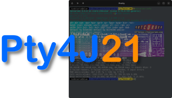

# Pty4J21 - Pseudo terminal(PTY) implementation in Java 21+.

[](https://maven-badges.herokuapp.com/maven-central/com.sshtools/pty4j21)
[](https://coveralls.io/github/sshtools/pty4j21)
[](https://javadoc.io/doc/com.sshtools/pty4j21)
 

 

This is a Java implementation of PTY, forked from [Pty4J](https://github.com/JetBrains/pty4j). Written for Java 21+, and making use of the [Foreign Function and Memory API](https://docs.oracle.com/en/java/javase/21/core/foreign-function-and-memory-api.html) together with the binary helpers and libraries from the upstream project.

While [Pty4J](https://github.com/JetBrains/pty4j) is pretty good, I feel some improvements are possible because Java has more moved on. See [More About This Fork](#more-about-this-fork) for a more detailed rationale.

### Features

In addition to everything provided by [upstream](https://github.com/JetBrains/pty4j),
 
 * Uses same binary helper DLLs and executables as upstream (these have not been rebuilt)
 * Zero external run-time dependencies, other than Java 21+.
 * In theory, should be faster than JNA based upstream. Further optimisation of FFM API is expected.
 * JPMS compliant.
 * Linux, Mac and Windows supported (and FreeBSD, untested).
 * Complete upstream API compatibility except for a couple of optional additions.
 * `PTYInputStrream, fastRead()` method for zero-copies of incoming PTY data.
 * `PTYProcess.getDisplayName()` public API method to get the pty name if known.

### Known Issues

 * Cygwin mode does not work, but then it doesn't seem to work for me using the upstream project either. Maybe I'm using wrong!
 * FreeBSD support should in theory work, but I do not currently have the facility to test. Feedback welcome.

## Dependencies

The legacy Windows pty implementation used here is the magnificent WinPty library written by Ryan Prichard: https://github.com/rprichard/winpty

## Adding Pty4J21 to your build

The releases are published to Maven Central: [com.sshtools:pty4j21](https://search.maven.org/artifact/com.sshtools/pty4j21).

### Maven

```xml
<dependency>
  <groupId>com.sshtools</groupId>
  <artifactId>pty4j21</artifactId>
  <version>0.21.0</version>
</dependency>
```

### Gradle

```groovy
dependencies {
  implementation 'com.sshtools:pty4j:0.21.0'
}
```

### Java 21

There are additional build-time and run-time requirements for Java 21 when native code is called.

Firstly, preview features must be enabled for compiling and unit tests. Exactly how this is done will depend on your environment, but to do this in Maven for example, add configuration to the compiler plugin and junit plugin.

```xml
<plugin>
	<groupId>org.apache.maven.plugins</groupId>
	<artifactId>maven-compiler-plugin</artifactId>
	<configuration>
		<enablePreview>true</enablePreview>
	</configuration>
</plugin>

<plugin>
    <groupId>org.apache.maven.plugins</groupId>
    <artifactId>maven-surefire-plugin</artifactId>
    <configuration>
        <argLine>--enable-preview --enable-native-access=com.sshtools.pty4j</argLine>
    </configuration>
</plugin>
```

At run-time, ensure you add  `--enable-preview --enable-native-access=com.sshtools.pty4j` runtime arguments.
If you are building an executable jar, you can add the `Enable-Native-Access` manifest attribute instead.

As from Java 22, you can remove the `--enable-preview` flag. 
 

## Usage

Using this library is relatively easy:

```java
var cmd = { "/bin/sh", "-l" };
var env = new HashMap<>(System.getenv());
env.put("TERM", "xterm");
var process = new PtyProcessBuilder().setCommand(cmd).setEnvironment(env).start();

var os = process.getOutputStream();
var is = process.getInputStream();

// ... work with the streams ...

// wait until the PTY child process is terminated
var result = process.waitFor();
```

The operating systems currently supported by pty4j are: Linux, OSX, Windows and FreeBSD.

## License

The code in this library is licensed under Eclipse Public License, version 
1.0 and can be found online at: <http://www.eclipse.org/legal/epl-v10.html>.

## Future Plans

Depending on interest, pty4j21 may diverge further from upstream. We are certainly going to be using it in place of pty4j for our own projects, so this fork is unlikely to become stale any time soon.

Some initial ideas of future direction include ..

 * Re-visit the helper libraries and executables to see if any can be re-implemented in Java. 
 * Investigate use with Graal native image. 
   * Provide Graal meta-data for easy native compilation.
   * Investigate whether running as a native image makes any difference to fork behaviour.
   * Investigate rewriting native libraries and helpers in Java, natively compiled.
 * Double as a serial port implementation too, i.e. like PureJavaComm. It is not far off! The Unix side has most of what is needed, it would mainly just be a Windows implementation and a public API.
 * Automatic discovery of shells available on the host operating system. 

## More About This Fork

This is an experimental, fork of the official [Pty4J](https://github.com/JetBrains/pty4j) that does **not** use JNA, PureJavaComm, Kotlin or SLF4J. Instead, it just requires Java 21 and uses a preview of the [Foreign Function and Memory API](https://docs.oracle.com/en/java/javase/21/core/foreign-function-and-memory-api.html).

This fork came about as I found Pty4J to be quite slow due to JNA use, taking up roughly 50% of all CPU time in my terminal emulator [Pretty](https://github.com/sshtools/pretty). In order to support bitmap graphics over the pty (for example using [Notcurses](https://notcurses.com/), the speed of the pty becomes way more important. It is hoped this experiment will give me a significant performance boost.

As well as performance increases afforded by FFM's faster bindings, a `fastRead()` method has been
been added to `PTYInputStream` that accepts a `MemorySegment`. This represents and provides access to a segment of off-heap memory, which may be created in the calling application and passed to Pty4J for reading data from the tty. The calling application may then read from this segment with no additional copies.

The other major improvement was to reduce the number of run-time dependencies to zero. This was mostly a natural result of having to re-implement supporting libraries such as [PureJavaComm](https://github.com/nyholku/purejavacomm/), and with JNA being replaced by FFMAPI. Along with many others, I have long suffered [this bug](https://github.com/JetBrains/pty4j/issues/105), that appears to be forgotten. This issue just goes away with this fork.  That left SFL4J, which has been replaced by `java.lang.System.Logger`, and Kotlin.

The removal of Kotlin may be more controversial. There were multiple reasons for this.

 * I personally am not very familiar with Kotlin, it is not something I use day to day. It was going to be hard enough to learn FFMAPI without having to learn another language to complete this task. 
 * The mixed language nature of this project did not work so well in my chosen IDE, Eclipse. I am aware there are Kotlin plugins but they did not work out-of-the-box for me with Java 21.
 * I see little reason for this slow change to Kotlin in the first place, particularly with the rapidly improving Java language. This introduces an entirely new language runtime just to provide a library with a very simple use case. It *looks* like maybe upstream will eventually rewrite the whole thing, I am not so sure as a consumer of this library I am on board with this.
 
If anyone can tell me *why* Kotlin (and SLF4J for that matter) are required for this project, please convince me! :)

**Pty4J21** continues to make use of the great upstream work by the folks at JetBrains in the various work-arounds and native parts required to get a PTY on Java, in fact these have not changed at all, and are still the same binaries. The public API also has not changed, but the Java side has had a fairly major re-write.  

The build was also recently changed to Kotlin. I am fine with that, but I cannot make it work with Java 21 and enabling preview features. Some weird error about operator ambiguity that I wasted too much time on. To make my life easier, a Maven POM has been added. This also lets me publish more easily to Maven Central and work in an environment I am way more familiar with.

Efforts will be made to keep this fork synchronized with upstream. It is likely most bug fixes would be applicable, but new features that turn up would be treated case by case. However, It is likely all but the simplest changes would require re-implementing.

 
### How Was This Achieved

The creation of this fork had a secondary, personal purpose. I was very interested in learning about FFMAPI, and this provided the ideal opportunity.

Many Java developers have probably at some point had some interaction with libraries that use native code in some way. Whether actually writing "Bindings" to some native library, or just consuming such a library to achieve some task, you probably will have encountered one of the following.

 * [JNI](https://en.wikipedia.org/wiki/Java_Native_Interface). The oldest, and built into Java. Writing for JNI is rather involved. You must write glue code in both Java and the native language (probably C). There are also deployment issues, you will need to provide binaries of this native glue code for all the operating systems you support. 
 * [JNA](https://github.com/java-native-access/jna). Really made made things better, at least for developers. Here was a way to interface to native code using just Java. Deployment was also easier, if you were interfacing to pre-exisiting libraries, you just need to ship your Java code. Over time, many JNA based libraries have become available. JNA is not perfect though, the main issue being performance. While big improvements have been made with this mature library, its very nature make it unsuitable for high performance requirements. A primary reason for this is it's use of reflection.
 * [JNR/FFI](https://github.com/jnr/jnr-ffi). Based on libffi, and in many ways similar to JNA, this avoids using reflection and so is more performant. It has other advantages too, but the biggest problem I always found was a severe lack of documentation. 
 
Other native Java related projects of note include [BridJ](https://github.com/nativelibs4java/BridJ) - another C/C++ interop library and [JNAerator](https://github.com/nativelibs4java/JNAerator), which can generate Java from C headers much like `jextract` that will be talked about in the next section.

#### Getting Started

A good portion of Pty4J (on Unix like systems at least) makes use of the standard C library, `libc`, so the porting effort started there.

The approach I decided to take, was to make use of the [jextract](https://github.com/openjdk/jextract) tool to get started. This OpenJDK tool takes C `.h` header files, and will turn them into usable Java code. 

The first command I used was something like this.

```
~/JDK/jextract-21/bin/jextract --source --output src --target-package com.pty4j.ffmtmp --library c native/exec_pty.h
```

This is saying, I would like to generate Java `--source` to the `--output` directory `src` using the `--target-package com.pty4j.ffmtmp` for `--library` named `c` the from the C header file in `native/exec_pty.h`. 

I chose `exec_pty.h` because it will likely `#include` most of the same parts of libc we need on the Java side.

By default, the jextract tool will generate source for *all* functions, structures etc that it discovers in *any* included header either provided directly, or a dependency, or dependency of a depdency and so on. This can produce a lot of Java source, which while "readable", has a lot of generated names particularly for constants which can be daunting. 

If you are just linking to an external library to use a few of it's functions, you probably do not want a lot of this bloat of functions that you will never call. You have a few techniques you could use to address this.

 * Only generate sources for the functions and other types you need. jextract has several command line options that would be of use, including `--include-function`, `--include-constants` and more. See the command `--help` for the full list.
 * Generate everything, and remove the functions you do not want manually. This is the approach I took at first until realising the were other options! Next time I'll certainly make efforts to use them.
 * There is nothing stopping you writing your own small `.h` file that has just the `#include`s you want, or even just the function definitions you need and generating Java from that. 
 
In general though, jextract is great and will be absolutely invaluable in giving Java access to native libraries of all kinds. While the code it generates can certainly be unfamiliar to pure Java programmers, I fully expect wrapper libraries of all kinds to spring up to make popular libraries more friendly to them.

#### Library Loading

Before we can use any these native functions via the generated Java classes, we must load the native library. By specifying `--library` in the original jextract, basic code for doing so will have been generated.

However, this was where I hit the first problem. With JNA, I had always been used to just providing the library name, e.g. `c`, and JNA would sort out all platform specific details of the locating and loading of the library. This might include such differences as ".dll" vs ".so" or whether the name prefixed with "lib" etc. 

You can use the legacy `System.loadLibrary()` methods, but I had read that it is recommended the new `SymbolLookup.libraryLookup()` methods are used instead. The jextract tool however will have generated something like this.

```java
System.loadLibrary("c");
SymbolLookup loaderLookup = SymbolLookup.loaderLookup();
SYMBOL_LOOKUP = name -> loaderLookup.find(name).or(() -> LINKER.defaultLookup().find(name));
```

This immediately failed for me, unable to find the library. After a little experimentation, I found that providing the full path to the actual library worked. In this case I am also using `libraryLookup()` instead.

```java
SymbolLookup loaderLookup = SymbolLookup.libraryLookup(Paths.get("/usr/lib/x86_64-linux-gnu/libc.so.6"), Arena.global());
SYMBOL_LOOKUP = name -> loaderLookup.find(name).or(() -> LINKER.defaultLookup().find(name));
```

Perhaps this is just a problem on some Linux platforms (I am using Linux Mint), but it could potentially to be a wider issue. So some better mechanism of locating the library may be needed. Or it may be that this is just a bug in the FFM API preview (it looks like perhaps Java does not understand GNU linker scripts which are in use here). 

Happy that the library was at least loading, I continued with the rest of the tasks to revisit this later.

Later on, I came to work on the Mac OS support and found similar issues. Mac OS doesn't actually have a "libc", but the system libraries do implement the functions it provides, so I would need to find out how to load them. 

Windows was less of an issue, for example `SymbolLookup.libraryLookup("kernel32", Arena.global())` worked fine.

So, knowing that JNA can happily access the C library functions on Mac OS when provided with the library name `c`, I decided to go look through JNAs source to see exactly how it does that.

It turned out that JNA does indeed have lots of work-arounds for Library loading, particularly for Linux and Mac OS. So the result was that I basically copied parts of JNAs `Native`, `Platform` and `NativeLibrary` classes, and replaced usages of `System.loadLibrary()` with the `SymbolLookup.libraryLookup` counterparts. 

The library initialisation now looks like this.

```java
SymbolLookup loaderLookup = Native.load("c", Arena.global());
SYMBOL_LOOKUP = name -> loaderLookup.find(name).or(() -> LINKER.defaultLookup().find(name));
```

If you are undertaking a similar task, the Java classes in `src/com/pty4j/Native.java` and `src/com/pty4j/Platform.java` will probably be useful to you too. You should just be able to drop these into your project and use `Native.load()` to load your library. 

Note how `Native.load()` takes an `Arena` parameter. An Arena is a scoped area of memory. Arenas other than the global one may be `close()`d for example. This effectively allows unloading of libraries as well, which may be useful in applications that have "Plugins". 

If no better solution to this problem presents itself, I will consider making these two classes available in a separate project as some kind of "FFM Utilities" library for others to easily use.

Does anyone out there know if there is a better way to do this? I do find it strange this is not something the JDK is better at.

#### Converting JNA Calls To FFM Calls

Now that the library itself is loading via FFM, I could start on the bulk of the work, converting everywhere that uses a JNA call to use the new generated classes instead.

There is no shortcut to this, it was a case of going through every function, one by one, examining the original code and it's parameters, and adjusting accordingly to FFM requirements. The differences between JNA and FFM in how they actually work will dictate much of what must change. 

JNA makes use of reflection to convert between Java primitives and objects to their native equivalents. The programmer defines a standard `interface` containing Java methods, each mapping to a function in the native library. Any parameters the native function requires are also repeated in the Java interface using standard Java types (well there is a little more to it, to this will do for now!). JNA will then convert the parameters when it is called on the Java side before passing appropriate types to the native side. Finally it will do the same with any return value, converting the returned native type back to the Java type defined in the interface. All of this happens at *run time*, and is large reason for JNAs lower performance.

FFM by contrast requires that you provide the rules for this conversion as Java code in the form of `MethodHandle` , `VarHandle`, `FunctionDescriptor`, `ValueLayout` objects and various other structures. The `jextract` tool will generate lots as static variables and classes with the same name as their native counterparts  (or generated names in some cases), which may then be reused by the various method calls it generates. So in effect,  FFM removes the reflection cost JNA has by moving it to *build time*.

The very first function I decided to convert was `Libc.open()`.  Here is how it looks as JNA in the PureJavaComm library. 

```java
public interface C_lib extends com.sun.jna.Library {
    int open(String path, int flags);    
}
```

And here is how it looks now as FFM code. 

```java
public final static class CLib {
	public static final AddressLayout POINTER = ValueLayout.ADDRESS.withTargetLayout(MemoryLayout.sequenceLayout(JAVA_BYTE));
	
	private static class open {
	
		public static final FunctionDescriptor DESC = FunctionDescriptor.of(ValueLayout.JAVA_INT,  POINTER, ValueLayout.JAVA_INT);
	
		public static final MethodHandle HANDLE = Helper.downcallHandleVariadic("open", DESC);
	}
		
	public static int open(MemorySegment __file, int __oflag, Object... x2) {
	    try {
	        return (int) HANDLE.invokeExact(__file, __oflag, x2);
	    } catch (Throwable ex$) {
	        throw new AssertionError("should not reach here", ex$);
	    }
	}
}
```

As you can see, that is quite a lot more code to achieve the same thing, but remember a lot of the above will be reusable for other functions. `POINTER` for example is going to be used all over the place (it's a C pointer), and `FunctionDescriptor` could be reused if you have lots of functions with identical parameter and return signatures.

For every native function though, there will be one `MethodHandle` and one static method that uses it. The static method of course isn't strictly necessary, you could just call `HANDLE.invokeExact()` directly.

Now lets look at how this code is called. Notice that in the JNA version, the first `path` parameters is a `String`, but in the FFM version we have a `MemorySegment`. So how do you convert a String to a MemorySegment, and why should we not do this conversion in the static `open()` method in our `CLib` class.

When calling the JNA method, you would do something like this ..

```java
int fd = CLIB_INSTANCE.open("/path/to/open", O_RDWR | O_NONBLOCK);
```

Whereas FFM would be ..

```java
int fd = CLib.open(Arena.ofAuto().allocateUtf8String("/path/to/open"), O_RDWR | O_NONBLOCK)
```

So not *too* different, but what is an `Arena` and why can't we just to do this in the static `CLib.open()` method? Well, in this case you actually could do that, but an `Arena` gives you more control over the life of the memory allocated by. JNA by default effectively does the same thing as `Arena.ofAuto()` does. It creates a segment of memory that exists only until the `MemorySegment` it creates can be garbage collected. 

However we may wish for it to last longer, and there are various different types of `Arena` that may be used to achieve this. There are arenas that last until the runtime ends (`Arena.global()`), or arenas that exist in a `try` scope and more. Each arena may have different `Thread` semantics too. 

### Rinse And Repeat

Now all that remains to do, is repeat the above for every single `libc` and `Kernel32` function that Pty4J uses, as well as the native helpers such as `libpty`, `conpty` and `winpty`. Easy! 

Well, it wasn't that easy, and there were lots of stumbles along the way, but the job is now done and working on the 3 target operating systems, apparently as well as the venerable pty4j library always has.
